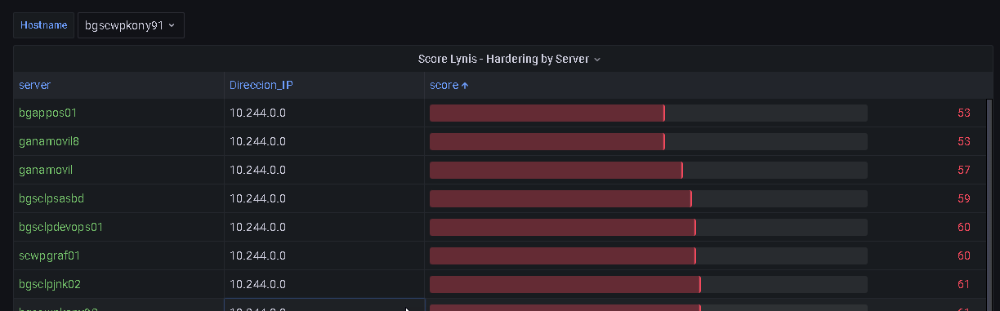

# lynis-bridge

Accept lynis-report.dat files (upload), transform it into json and put it into a mariadb to visualize the result with grafana.



## notes

```
curl -F data=@lynis-report.dat http://localhost:8080/upload
```